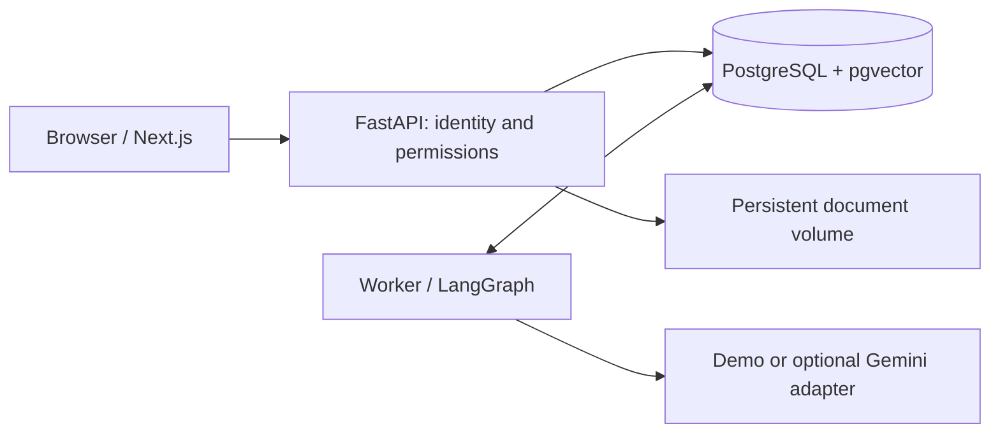

# AI Counterparty & Compliance Analyst

Assess technology counterparties against your organization's reviewed security and
privacy policies. Upload documents, approve structured requirements, run an
assessment, inspect cited evidence and record a human decision. Save and copy a
plain-text request for missing information from the report.

The local MVP includes an English Next.js interface, FastAPI, PostgreSQL/pgvector,
and a durable LangGraph worker. New analyses use
**semantic-v2**: each reviewed requirement is assessed against retrieved evidence
and relationship context. Gemini performs interpretation when explicitly configured.
A pinned multilingual E5 model prepares embeddings locally on CPU.

**New analyses in default demo mode call no LLM and conservatively return unknown assessments.**
Its policy proposals are source-review placeholders, not extracted obligations.
No API key is needed to explore the workflow. Demo results and mocked tests do not
establish real-model quality. All bundled organizations and documents are synthetic.

## Start

Install Docker with Compose v2, then run from this directory:

```bash
cp -n .env.example .env
docker compose up --build -d --wait
docker compose run --rm -e MODEL_MODE=demo seed
```

Open [the application](http://localhost:3000) or [API docs](http://localhost:8000/docs).
Select a demo account on the login screen. All seeded passwords are
`Demo-only-2026!`:

| Account | Access |
|---|---|
| `analyst@northstar.demo` | All organization cases, counterparty evidence and analyses until acceptance or rejection |
| `reviewer@northstar.demo` | Organization cases, policy approval, decisions and final case review |
| `analyst@other.demo` | Separate organization for isolation demonstrations |

`seed` is explicit and repeatable. It creates three accounts using two roles,
four Northstar policy documents, 20 narrative requirements extracted by Gemini,
and an Atlas case with its declaration and a recorded Gemini assessment report.
The fixture is [gemini-example.json](datasets/synthetic/gemini-example.json): it
records the model, prompt version, token usage, document hashes and retrieval scores.
Seeding validates the source files and remaps citations to the new database IDs.
It never calls Gemini. Recorded reports are labeled in the UI; new analyses in demo
mode still return conservative unknown results. The example awaits a reviewer decision.
The policy's approved state is a demonstration setup, not independent human review.
Repeated seeding preserves existing records and does not recreate deleted examples.
An already initialized workspace is not overwritten or reset by this command.
Analysts collaborate on all cases within their organization. Only reviewers manage company
policy sources and requirements, record decisions and delete whole cases.
An accepted or rejected decision closes the case to analyst changes. A request for
information leaves it open for new evidence and another analysis; reviewed reports stay unchanged.
Document/reference and active-operation deletion guards apply to both roles.

For a fresh empty workspace with just the Northstar analyst and reviewer, seed accounts only:

```bash
docker compose run --rm -e MODEL_MODE=demo seed python -m counterparty.bootstrap --fixtures /datasets --accounts-only
```

This command creates accounts; it does not erase existing data. The login screen lists only
seeded active demo accounts. Existing administrators migrate to reviewer; retired auditor
accounts are disabled and their sessions revoked, preserving historical authorship.

Use the reviewer account for the complete demo journey. Demo credentials are for
local synthetic use only. `DEMO_MODE=false` disables
seeded account login; this is not a production identity-management system.

The frontend and API bind to loopback; the database stays on
the Docker network. `FRONTEND_PORT`/`API_PORT` can change exposed ports; also adjust
`ALLOWED_ORIGINS` for a nondefault frontend origin. First build requires network
access to public image/package registries. On first indexing, the worker also
automatically downloads 487 MB of pinned public model artifacts (no account/key)
into the persistent `model-cache` volume. A verified cache supports offline reuse;
subsequent demo operation uses local services. Database passwords are passed separately from the URL. In
`.env`, single-quote values containing `$` to avoid Compose interpolation.

## Walk through the application

1. Open **Policies** and inspect the approved synthetic policy set. Upload a text
   PDF, Markdown or TXT and open its **Full document** view. Source excerpts and
   technical indexing controls are secondary details; the original remains downloadable.
2. Click **Extract requirements**, or select documents through **New policy set**.
   Extraction reads the complete selected policy text within the limits below and
   saves its result. Opening that version or repeating the same extraction reuses
   the saved result. **Regenerate requirements** explicitly confirms new model API
   calls and creates a new draft; viewing a document never triggers extraction.
3. Review each requirement's description, applicability, severity and exact source
   quotation, then approve the version. Requirements cannot be edited or cloned.
   Regenerate an incorrect extraction, or upload revised source documents and
   extract a new set when the policy changes. The worker prepares and caches embeddings
   for the approved requirements in the background.
4. Open **Cases**, create a relationship context, and upload counterparty evidence.
   Label each source as a declaration or independent support. Run an analysis
   against an approved policy once its requirements and evidence are ready.
   All new analyses use hybrid retrieval (keywords and semantic similarity).
5. Watch progress as the worker assesses requirements sequentially. A failed run
   exposes **Resume unfinished requirements**. Saved completed assessments are
   reused; unfinished work may make additional API calls. Partial results are not
   presented as a final report.
6. Inspect risk, evidence completeness and finding status separately. Each finding
   places the policy requirement and its source next to the counterparty evidence,
   with an explanation. Open citations to inspect exact excerpts and the full source.
   Missing evidence does not prove compliance. A possible discrepancy is not
   automatically a contradiction.
7. If evidence is missing, the analyst can save an information-request draft.
   The saved draft is read-only for the analyst; the reviewer can edit it before
   recording a request for information. Copy the final text to your email client;
   the application does not send messages.
8. The reviewer records acceptance, rejection or a request for information with
   a rationale. The worker resumes its saved workflow after that decision.
   A request for information lets the analyst upload a reply as evidence and run
   a new assessment; the previous report and review remain unchanged. Acceptance
   or rejection closes the case to further analyst changes.

For a synthetic example, upload
`datasets/synthetic/evidence/atlas-assurance-pack.md` as a **Counterparty declaration**
in a high-criticality case with personal data and privileged access. The pack is
not the independent report it describes. Inspect the support-portal assurance
exclusion and US support-access boundary. No fixed completeness percentage or
finding count is promised for a real-model assessment. Demo mode conservatively
leaves interpretation unresolved.

Historical tiny scenarios remain under `backend/tests/fixtures/regression` for tests
and are never seeded. Older approved policy versions and reports remain readable;
new assessments use the semantic workflow. An English interface does not imply
universal policy understanding.

## Architecture and data flow



The API captures immutable input versions before queuing a run. The worker retrieves
scoped evidence using pgvector and the approved requirement embeddings. Saved
retrieval provenance retains queries, scores, eligible chunks and model configuration.
For each requirement, the configured model interprets applicability and evidence,
returning a validated status, explanation and source quotations. The application
checks quotation grounding and aggregates risk and completeness using versioned
code. A matching quotation proves source resolution, not semantic entailment.

Each completed requirement assessment is persisted before the next begins. Explicit
retry resumes unfinished work without repeating saved completed assessments, including
completed paid model calls. A provider call interrupted before its result is saved
may still be repeated. The finished report pauses at a durable human-review checkpoint.
Neither a document nor a model grants permissions or authorizes a write.

See the [current architecture](docs/architecture.md) for module boundaries,
trust rules and durable execution, and [evaluation methodology/results](evaluations/README.md)
for reproducible experiments. Historical rule-pipeline scores do not validate
semantic-v2; retrieval measurements do not establish correctness of interpretation.

## Verification

Backend tests run against disposable PostgreSQL databases, independent of the app:

```bash
docker compose -f compose.test.yaml up --build --abort-on-container-exit --exit-code-from tests
docker compose -f compose.test.yaml run --rm --no-deps tests ruff check .
docker compose -f compose.test.yaml run --rm --no-deps tests ruff format --check .
docker compose -f compose.test.yaml down
```

Frontend checks require Node 24 and Chrome (or `npx playwright install chrome`):

```bash
cd frontend
npm ci
npm run build
npm run typecheck
npm run test:e2e
E2E_REAL_API=1 PLAYWRIGHT_BASE_URL=http://127.0.0.1:3000 npm run test:e2e
```

Historical compatibility cases run as ordinary backend regression tests.
The real-stack browser test covers upload, indexing, worker execution, complete
requirement coverage, exact source citations and the saved human decision. It
requires a seeded **demo-mode** stack and rejects Gemini before creating records.
It writes synthetic cases to that stack. Other browser tests use mocked HTTP.
CI runs both without provider keys; demo results do not establish model quality.

## Optional real model

Leave `MODEL_MODE=demo` to run without external credentials. To evaluate Gemini,
provide **`GEMINI_API_KEY` and an explicitly selected `GEMINI_MODEL`** in your local
`.env`. Verify the model's availability, account quotas and data terms first.
No billing activation or paid fallback is configured. Never commit the key.

Choose a model available to your account; there is no automatic substitution.
The maintained checks and their limitations are documented in
[evaluations](evaluations/README.md).

Set `MODEL_MODE=gemini` and recreate API/worker via `docker compose up -d`.
For the explicit current-pipeline integration check, see the
[evaluation guide](evaluations/README.md#explicit-current-pipeline-smoke-check).
Keep `DEMO_MODE=true` for local demo accounts. Configured-provider failures are
reported; they never silently switch to demo responses. Requests are bounded;
pricing is unknown (`null`) until checked externally.

## Removing saved data

Use **Delete report**, **Delete case**, **Delete policy set** or the document's
**Delete** action. A case deletion includes its reports and evidence documents;
a report deletion includes its decision and saved analysis progress. Delete
referencing reports before a policy set, and referencing policy sets before their
source documents. Deletion applies to active application storage, not existing
backups or model-provider records.

Source links open the full original text and highlight the exact cited passage.
Mechanical search chunks are not shown as excerpts. If the passage cannot be
located unambiguously, the document view says so instead of highlighting a guess.

## Operations and limitations

```bash
docker compose logs api worker migrate
docker compose run --rm migrate alembic current
docker compose run --rm migrate alembic check
docker compose down
```

`down` preserves database, document and model-cache volumes. See
[backup, restore and retention](docs/operations.md) before deleting
volumes. The migrations build/update database structure; they do not analyze files.

Policy extraction accepts at most 100,000 source characters across selected documents,
with a 125,000-character model payload limit and 16,384 maximum output tokens.
Each requirement assessment has a 25,000-character input limit and 4,096 maximum
output tokens. Runs accept at most 100 requirements and 500 evidence chunks, with
at most three attempts per requirement. Oversized inputs fail explicitly rather
than silently dropping policy text. Full-document extraction does not guarantee
that the model identifies every obligation or correctly interprets exceptions.

This is a local portfolio MVP, not legal certification or production assurance.
OCR, real business integrations, public hosting, enterprise administration,
PDF report export and MCP are outside this release.
Scanned PDFs receive an unsupported-input error. The app database account owns
its schema; public deployment needs separate restricted credentials, managed
identity, TLS, shared quota controls and operational review.

## Repository

- `backend/src/counterparty/`: API/domain, ingestion, adapters, semantic assessment and risk aggregation,
  worker and packaged database migrations.
- `frontend/`: Next.js UI and browser tests.
- `datasets/synthetic/`: four substantial policies, an Atlas assurance pack and a recorded Gemini example.
- `backend/tests/fixtures/`: small documents used only by regression tests.
- `evaluations/`: local retrieval benchmark, explicit Gemini smoke check.
- `docs/`: architecture, operations and retrieval measurements; generated API docs live at `/docs`.
- `.github/workflows/ci.yml`: reproducible checks without paid model calls.
