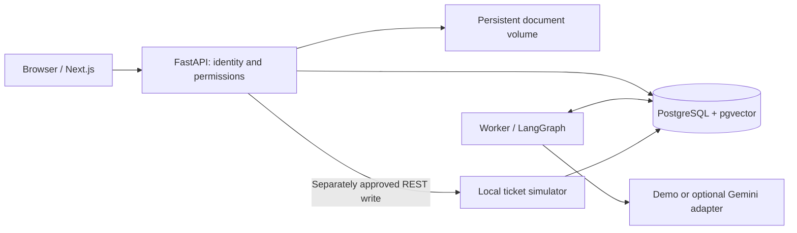

# AI Counterparty & Compliance Analyst

Assess technology counterparties against your organization's reviewed security and
privacy policies. Upload documents, approve structured requirements, run an
assessment, inspect cited evidence and record a human decision. Follow-up tickets
require their own explicit approval.

The local MVP includes an English Next.js interface, FastAPI, PostgreSQL/pgvector,
a durable LangGraph worker and a local REST ticket simulator. **The default demo
uses deterministic English fact extraction; it does not call an LLM.** A local
pretrained multilingual E5 model runs semantic retrieval on CPU. No
API key is required. An optional Gemini adapter and separate evaluation runner
are included; real-model quality remains unverified without credentials and a
reviewed evaluation. All bundled organizations and documents are synthetic.

## Start

Install Docker with Compose v2, then run from this directory:

```bash
cp -n .env.example .env
docker compose up --build -d --wait
docker compose run --rm -e MODEL_MODE=demo seed
```

Open [the application](http://localhost:3000) or [API docs](http://localhost:8000/docs).
Select a demo account on the login screen. All seeded passwords are
`Demo-only-2026!`:

| Account | Access |
|---|---|
| `analyst@northstar.demo` | Own cases, documents, policy drafts and analyses |
| `reviewer@northstar.demo` | Organization cases, policy approval, decisions and ticket approval |
| `auditor@northstar.demo` | Organization read-only access |
| `admin@northstar.demo` | Local administrator role |
| `analyst@other.demo` | Separate organization for isolation demonstrations |

`seed` is explicit and repeatable. It creates five role accounts, four substantial policy documents and one approved
Northstar Labs Third-Party Assurance Standard with 20 curated controls. It creates
no cases, evidence uploads, reports, tickets or old demo history. One audit event
records the new synthetic policy seed and its provenance. The seeded
approval is a synthetic fixture state, not an independent human review. It does not invoke a model or auto-approve a real external action.
Use the reviewer account for the complete demo journey. Demo credentials and the
shared ticket token are for local synthetic use only. `DEMO_MODE=false` disables
seeded account login; this is not a production identity-management system.

The frontend and API bind to loopback; the database and ticket simulator stay on
the Docker network. `FRONTEND_PORT`/`API_PORT` can change exposed ports; also adjust
`ALLOWED_ORIGINS` for a nondefault frontend origin. First build requires network
access to public image/package registries. On first indexing, the worker also
automatically downloads 487 MB of pinned public model artifacts (no account/key)
into the persistent `model-cache` volume. A verified cache supports offline reuse;
subsequent demo operation uses local services. Database passwords are passed separately from the URL. In
`.env`, single-quote values containing `$` to avoid Compose interpolation.

## Walk through the application

1. Open **Policies**. Inspect the approved synthetic policy set and their
   source citations. Upload your own text PDF, Markdown or TXT; propose, edit and
   approve requirements. Clone approved policies to create a new editable version.
2. Open **Cases**. Create a case with relationship context:
   personal data, privileged access, purpose and business criticality.
3. Add evidence and label its provenance as a declaration or independent support.
   Wait for **Semantic index: ready**, then start an analysis against an approved
   policy version. Semantic retrieval is the default; weighted hybrid and lexical
   variants are available. Lexical analysis works while indexing is unavailable.
4. Inspect risk, evidence completeness and individual findings separately. Open a
   citation to see its exact source fragment. Missing evidence produces questions;
   it does not prove compliance. A possible discrepancy is not automatically a
   contradiction.
5. Record acceptance, rejection or a request for information with a rationale.
   The worker resumes its saved workflow after that human decision.
6. Propose a follow-up ticket, inspect its exact title/body, approve, then execute.
   Read its status in the local ticket service. A lost response can be reconciled
   without creating another ticket. Review the activity history.

Upload `datasets/synthetic/evidence/atlas-assurance-pack.md` as a **Counterparty
declaration** in a high-criticality case with personal data and privileged access.
The six supported controls pass; 14 manual controls remain unknown, giving 30%
completeness and **Unable to assess** risk. Request information about the support
portal excluded from independent assurance and the US support access boundary.
The pack is a supplier declaration, not the independent report it describes.

Historical tiny scenarios remain under `datasets/synthetic/regression` for tests.
They are never seeded.
The demo extractor recognizes a documented subset of **English** policy/evidence
statements. Other requirements remain editable manual checks. An English interface does
not imply universal policy understanding.

## Architecture and data flow



The API captures immutable input versions before queuing a run. pgvector computes
scoped similarities in the worker. A separate write-once retrieval snapshot retains
queries, scores, exact eligible chunks and the full model configuration. The worker
extracts facts and evaluates allowlisted rules, writes a report, then pauses at a
persisted human-review checkpoint. Rules in application code calculate risk;
neither a document nor a model grants permissions or authorizes a write.

See [architecture and tradeoffs](docs/architecture/mvp.md),
[API and persistence contract](docs/architecture/mvp-contract.md),
[verification record](docs/verification/mvp.md) and
[evaluation methodology/results](evaluations/README.md) and
[Northstar corpus acceptance](docs/verification/northstar.md) and
[local semantic retrieval](docs/verification/embeddings.md).

## Verification

Backend tests run against disposable PostgreSQL databases, independent of the app:

```bash
docker compose -f compose.test.yaml up --build --abort-on-container-exit --exit-code-from tests
docker compose -f compose.test.yaml run --rm --no-deps tests ruff check .
docker compose -f compose.test.yaml run --rm --no-deps tests ruff format --check .
docker compose -f compose.test.yaml run --rm --no-deps --user "$(id -u):$(id -g)" \
  -v "$PWD/evaluations:/evaluations" tests python /evaluations/run.py --check
docker compose -f compose.test.yaml down
```

Frontend checks require Node 24 and Chrome (or `npx playwright install chrome`):

```bash
cd frontend
npm ci
npm run build
npm run typecheck
npm run test:e2e
E2E_REAL_API=1 PLAYWRIGHT_BASE_URL=http://127.0.0.1:3000 npm run test:e2e
```

`python3 scripts/verify_demo.py` explicitly creates an Atlas case on a disposable
demo stack, uploads its declaration, verifies the 6/14 result and source citations,
and records a request for information through the real API/worker.

The final browser command needs the running, seeded Compose stack and writes synthetic
cases to it. Browser boundary tests use mocked HTTP; the real-stack test uses the
actual API, database, worker and ticket service. CI runs both without model keys.

## Optional real model

Leave `MODEL_MODE=demo` to run without external credentials. To evaluate Gemini,
provide **`GEMINI_API_KEY` and an explicitly selected `GEMINI_MODEL`** in your local
`.env`. Verify the model's availability, account quotas and data terms first.
No billing activation or paid fallback is configured. Never commit the key.

The first live integration used `gemini-3.5-flash-lite`. On 2026-09-14 Google
rejected `gemini-2.5-flash-lite` for a new account despite listing it in Models.
The [live verification report](docs/verification/gemini.md) records compatibility
fixes, before/after measurements and the remaining quality limits. Availability
still depends on the account; there is no automatic model substitution.

Run a separate real-model evaluation before enabling it for normal analyses:

```bash
docker compose run --rm --no-deps --user "$(id -u):$(id -g)" \
  -v "$PWD/evaluations:/evaluations" api python /evaluations/run.py --mode gemini
```

Missing credentials produce a `pending_credentials` report and exit code 2. This
is an explicit incomplete quality check, not a passing model evaluation. Once
reviewed, set `MODEL_MODE=gemini` and recreate API/worker via `docker compose up -d`.
Keep `DEMO_MODE=true` for local demo accounts. Configured-provider failures are
reported; they never silently switch to the deterministic demo. Model extraction
has bounded requests; pricing is unknown (`null`) until checked externally.

## Operations and limitations

```bash
docker compose logs api worker tickets migrate
docker compose run --rm migrate alembic current
docker compose run --rm migrate alembic check
docker compose down
```

`down` preserves database, document and model-cache volumes. See
[backup, restore and retention](docs/architecture/operations.md) before deleting
volumes. The migrations build/update database structure; they do not analyze files.

This is a local portfolio MVP, not legal certification or production assurance.
OCR, real business integrations, public hosting, enterprise administration,
PDF report export and MCP are outside this release.
Scanned PDFs receive an unsupported-input error. The app database account owns
its schema; public deployment needs separate restricted credentials, managed
identity, TLS, shared quota controls and operational review.

## Repository

- `backend/src/counterparty/`: API/domain, ingestion, adapters, assessment rules,
  worker, ticket integration and packaged database migrations.
- `frontend/`: Next.js UI and browser tests.
- `datasets/synthetic/`: four substantial policies, an Atlas assurance pack and historical regression fixtures.
- `evaluations/`: frozen synthetic retrieval corpus and explicitly labelled demo/provider regression reports.
- `docs/`: architecture, contract and verification evidence.
- `.github/workflows/ci.yml`: reproducible checks without paid model calls.
