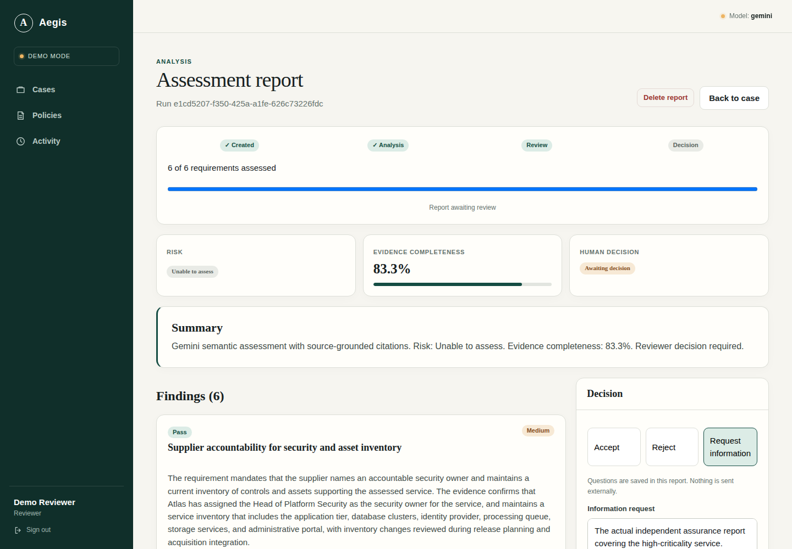
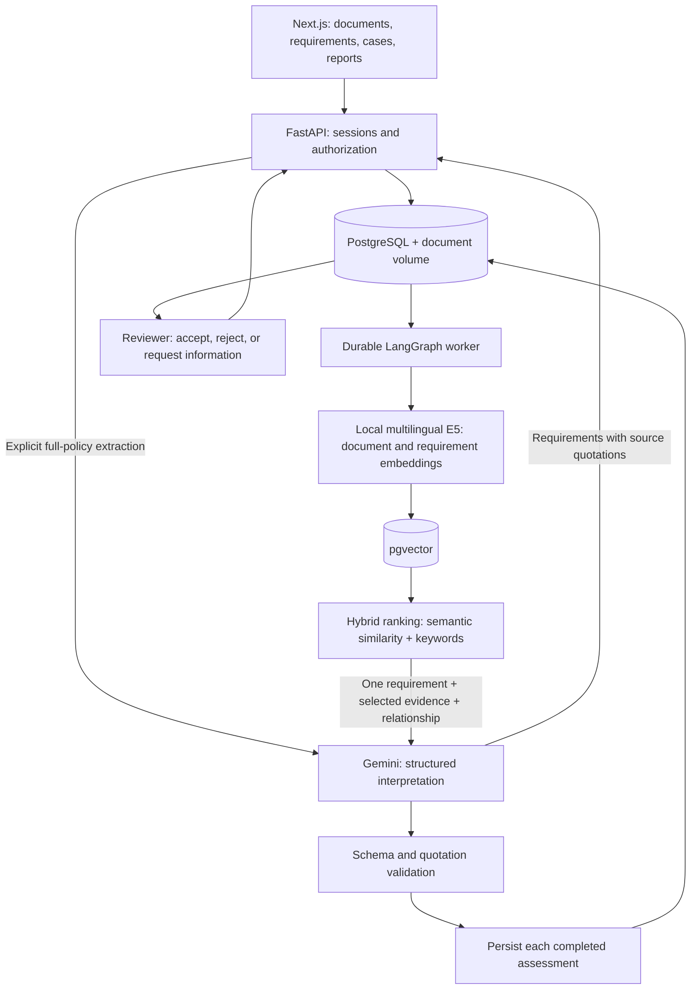
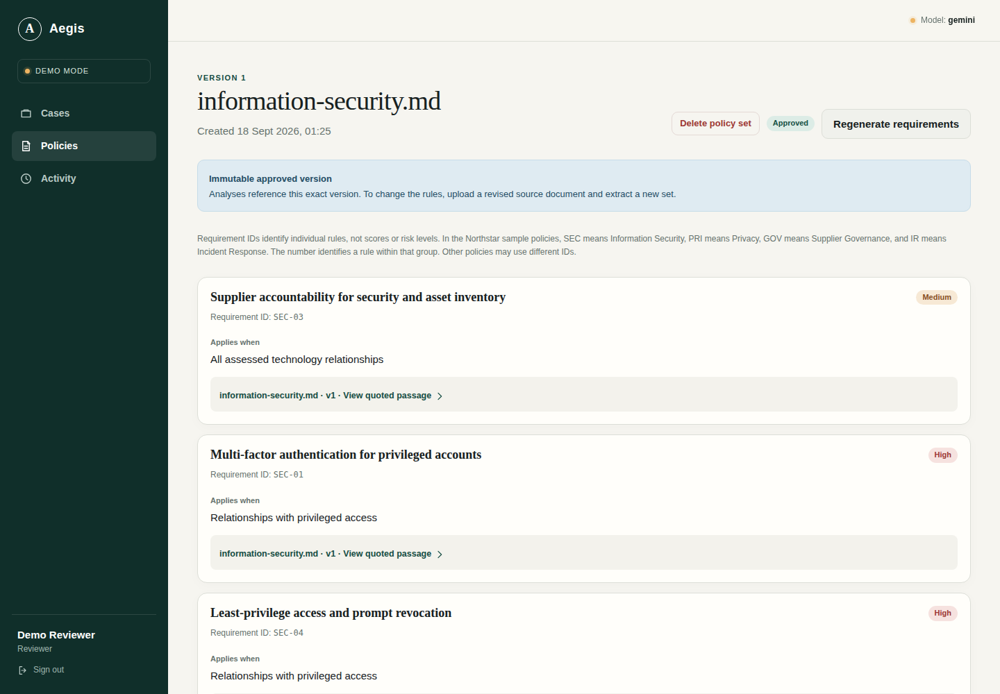
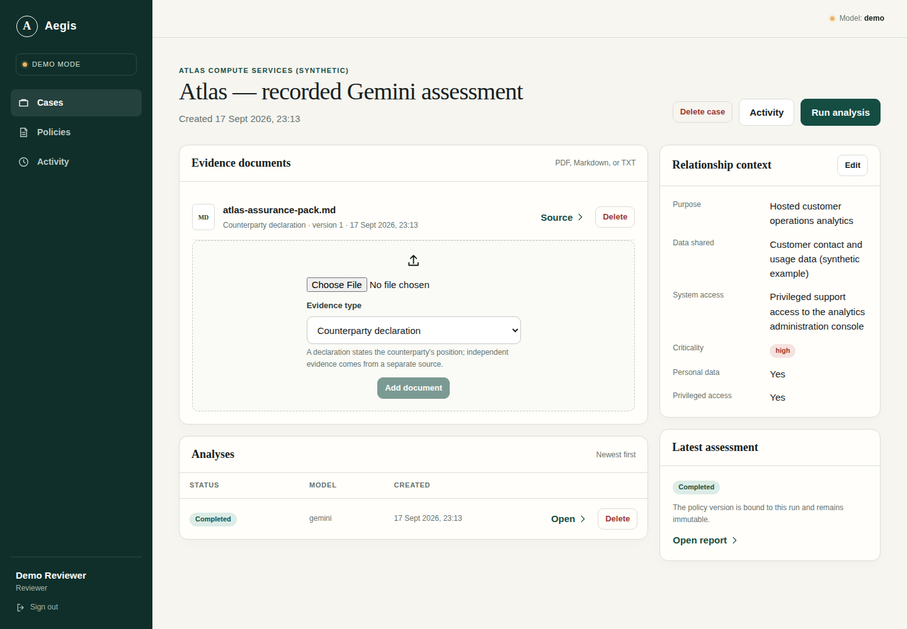
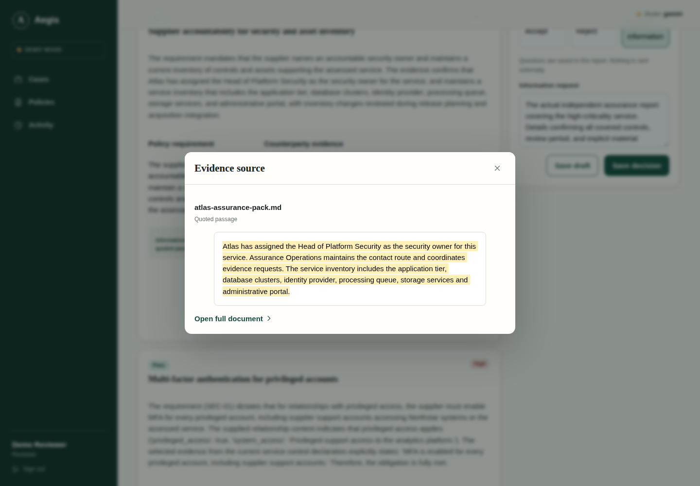

# AI Counterparty & Compliance Analyst

Compare a supplier's documents with your organization's policies, inspect the evidence
behind each finding, and record a human decision. The application turns uploaded policies
into reviewable requirements, retrieves relevant counterparty passages, and asks Gemini to
assess each requirement in the context of the business relationship.

**Python · FastAPI · PostgreSQL/pgvector · LangGraph · local multilingual E5 · Gemini · Next.js**

This is a runnable portfolio application with persistent workflows, two-role authorization,
source-linked reports and a reproducible evaluation. All bundled companies and documents
are synthetic. It supports decisions; it does not certify compliance.

The assessment report separates risk, evidence completeness and the reviewer's decision,
with source-linked findings below.



## What the evaluation shows

On a small reserved synthetic set, hybrid retrieval used **15.1% fewer input + output tokens**
than sending all evidence chunks, with the same status agreement on **15 paired assessments**.
This is agreement with agent-authored reference labels, **not independently human-validated accuracy**.

| Paired comparison: 5 cases / 15 requirements | Hybrid retrieval | Full context |
|---|---:|---:|
| Status agreement with reference labels | 15/15 | 15/15 |
| Input tokens | 32,387 | 39,031 |
| Output tokens | 4,651 | 4,604 |
| Total assessment tokens | **37,038** | **43,635** |
| Median provider HTTP time | 1.78 s | 1.74 s |
| Sufficient quoted support, non-independent agent review | 15/15 | 14/15 |

The full context baseline uses the same model, prompt, output schema and citation metadata;
only evidence selection changes. It is a controlled all-chunks baseline, not an optimized
alternative full-document prompt. One additional case exceeded the application's
25,000-character input cap in this arm; it is excluded from paired savings, not truncated.
Hybrid completed all six reserved cases: **18/18 status agreements**, with **21/21 annotated
evidence groups retrieved** and no false passes among nine fail/unknown/conflict references.

The useful qualification is **where savings came from**:

- Four short paired cases had identical input-token counts. Output variation made hybrid's
  combined total 0.5% higher. Retrieval offered no input saving there.
- One long paired case, with 13,833 source characters and three requirements, used **30.9%
  fewer combined tokens**. This single case accounts for the observed overall saving.
- Three policy extractions cost another **4,915 tokens**, shared by both approaches.
  Adding that cost once to each paired arm reduces the saving to **13.6%**.
- No latency advantage was demonstrated. Timings exclude API/worker queues; rate-limit
  pacing and local indexing are recorded separately. Token reduction is not a dollar-cost estimate.

Extraction recovered all **9/9 reference obligations** in the final set according to
non-independent agent review. All completed outputs passed the production source validator.
However, one full-context conflict quotation omitted an important same-period/precedence
qualifier present in the source. **Finding a quotation is different from proving a conclusion.**

Development exposed missing-information, applicability and exception-handling errors and
informed prompt revisions. The final development pass still had **one false pass (35/36 status
agreements)** despite recovering all annotated evidence. The reserved test was run after
freezing code and prompts, with no tuning on its results. Its perfect status agreement on
18 requirements is not evidence of general reliability.

The [evaluation guide](evaluations/README.md) links the topic-organized documents, expected
answers, protocol, runnable code and **one results artifact containing every provider attempt**.
For a readable comparison, [expand the six final test cases](evaluations/README.md#final-cases-inspect-the-actual-results)
to inspect the expected answers, actual Gemini explanations, quotations and per-assessment token counts.
Limitations include single observations, small short policies, authoring bias, shared synthetic
background templates, only English/Polish text, and pending independent human review.

## How it works



1. **Upload organization policies.** Text-based PDF, Markdown and TXT become readable
   source text with stable document versions. The UI shows whole documents. Internal
   chunks support retrieval and citation anchoring.
2. **Extract and approve requirements.** An explicit action sends the selected policy text
   to Gemini. The resulting obligations include applicability and exact source quotations.
   Reviewers approve the version; ordinary viewing reuses stored extraction. Incorrect
   extraction can be regenerated, while revised documents create a new policy version.
3. **Describe the relationship and upload counterparty evidence.** Personal data, access
   and criticality affect applicability. Documents are labeled as declarations or independent
   support. The worker indexes them using pinned `multilingual-e5-small` on local CPU.
4. **Assess each requirement.** Hybrid ranking combines semantic similarity and keyword
   matches, selecting up to eight evidence chunks. Gemini returns `pass`, `fail`, `unknown`,
   `conflict` or `not_applicable`, an explanation, quotations and missing-information requests.
5. **Validate, persist and review.** Backend code checks response structure and quotation
   grounding, aggregates risk/completeness, and saves progress. A reviewer makes the business
   decision. An information request is saved text that can be copied to email; the app does not send it.

Gemini interprets the documents. Application code controls identity, access, source versions,
retrieval boundaries, validation, job recovery and decision permissions. Neither a model response
nor instructions embedded in an uploaded document can grant permissions or authorize a decision.

Completed requirement assessments survive an interrupted run. Explicit resume reuses them;
a provider call interrupted before persistence may still need repeating. Accepted/rejected cases
are closed to analyst changes. Requesting information leaves the case open for new documents
and a new report; the reviewed report stays unchanged.

## Run locally

Install Docker with Compose v2, then:

```bash
cp -n .env.example .env
docker compose up --build -d --wait
docker compose run --rm -e MODEL_MODE=demo seed
```

Open [the application](http://localhost:3000) or [API documentation](http://localhost:8000/docs).
Select a seeded account; each demo password is `Demo-only-2026!`.

| Account | Permissions |
|---|---|
| `analyst@northstar.demo` | Collaborate on organization cases; upload counterparty evidence, run analyses and draft information requests while cases are open |
| `reviewer@northstar.demo` | Also manage organization policies, approve requirements, edit information requests and record decisions |
| `analyst@other.demo` | Separate organization for isolation demonstrations |

The explicit, repeatable seed creates four policies, 20 **recorded Gemini requirements**,
and an Atlas case with a **recorded Gemini report**. It makes no provider calls and validates
fixture document hashes and citations. The UI labels recorded results. Existing records are
preserved; seeding does not reset your workspace. The approved example is demo setup,
not independent policy review.

**New analyses in default demo mode call no LLM and return conservative unknown findings.**
Demo policy extraction provides source-review placeholders. For meaningful new interpretation,
set `MODEL_MODE=gemini`, `GEMINI_API_KEY` and an explicitly chosen `GEMINI_MODEL` in your private
`.env`, then recreate API and worker with `docker compose up -d`. No automatic model substitution,
billing activation or paid fallback is configured. Never commit the key.

For accounts without bundled documents, use:

```bash
docker compose run --rm -e MODEL_MODE=demo seed python -m counterparty.bootstrap --fixtures /datasets --accounts-only
```

First indexing downloads approximately 487 MB of pinned public E5 artifacts into a persistent
Docker volume. No embedding API key is required. Later indexing reuses that cache locally.
The API and frontend bind to loopback; PostgreSQL remains on the Docker network.
`FRONTEND_PORT`/`API_PORT` change exposed ports; adjust `ALLOWED_ORIGINS` for another frontend origin.
In `.env`, single-quote values containing `$` to avoid Compose interpolation.

## Try the workflow

These screenshots show the bundled synthetic Northstar/Atlas example. Sign in as reviewer
to explore its saved requirements and Gemini report without making model calls.

First, open **Policies** to review the extracted requirements, their applicability and links
to the original policy passages. Approval fixes the version used by subsequent analyses.



Next, open the counterparty case to collect its evidence documents and describe the relationship:
what data is shared, which systems are accessible and how critical the service is.



After analysis, follow a finding's citation to inspect the exact supporting passage.
**Open full document** provides the surrounding source text for a closer review.



Finally, use the report to accept, reject or request information. An analyst can supply
additional evidence for an information request and generate another report. For your own
assessment, start by uploading a policy, explicitly extracting and approving its requirements,
then creating a case and uploading counterparty evidence.

**Delete** actions remove saved application records subject to reference and active-operation
guards. Delete referencing reports before policy sets, and policy sets before their source
files. Deletion does not erase existing backups or provider-held records.

## Verification and repository map

The current evaluation work was checked with **188 backend tests**, including disposable
PostgreSQL integration tests, quota failure, saved-step recovery and evaluation accounting.
Provider responses in ordinary tests are mocked; the live evaluation above is separate.

```bash
# Backend, database integration and evaluation-accounting tests
docker compose -f compose.test.yaml up --build --abort-on-container-exit --exit-code-from tests

# Frontend: Node 24 and Chrome required
cd frontend
npm ci
npm run build
npm run typecheck
npm run test:e2e
# Explicit demo-stack integration test; creates synthetic records
E2E_REAL_API=1 PLAYWRIGHT_BASE_URL=http://127.0.0.1:3000 npm run test:e2e:real
```

| Location | Purpose |
|---|---|
| `backend/src/counterparty/` | API, authorization, ingestion, model adapter, retrieval, durable worker and schema migrations |
| `frontend/` | English interface and browser tests |
| `backend/tests/` | Technical regression and database integration tests |
| `datasets/synthetic/` | Seed documents and authentic recorded Gemini example |
| `evaluations/cases/` | Development/reserved policy families with documents, proposed answers and evidence annotations |
| `evaluations/run.py`, `protocol.json`, `results.json` | Reproduction, methodology and complete measured attempts |
| `docs/` | Focused [architecture](docs/architecture.md), [operations](docs/operations.md) and [retrieval](docs/retrieval.md) detail |

## Boundaries

Policy extraction accepts up to 100,000 source characters and a 125,000-character payload;
its output cap is 16,384 tokens. Each assessment has a 25,000-character input and 4,096-token
output cap. Runs accept up to 100 requirements and 500 evidence chunks, with bounded retries.
Oversized inputs fail explicitly. These application limits are not claims about a model's
maximum context window.

The project does not implement OCR, external message delivery, production identity management
or public hosting. Demo accounts are for local synthetic use. Public deployment would require
managed identity, TLS, restricted database credentials and operational controls; see
[operations](docs/operations.md). `docker compose down` preserves volumes. Do not remove volumes
containing data you need.
